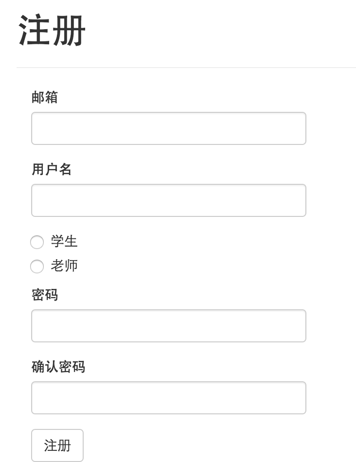
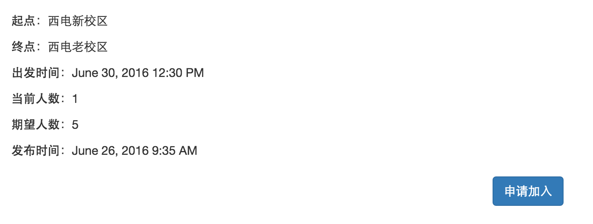

###操作使用说明书
####一、网址：
http://carpool.datwobee.com
####二、注册与登录
#####2.1 注册

点击页面右上角注册按钮，在上图页面内进行注册。
邮箱一定要填写您的可用邮箱，我们将在您注册成功后，为您发送电子邮件确认您的身份。
您可以选择两种身份进行注册。学生身份可以发布拼车信息，老师身份可以发送顺风车信息。
请确保密码与确认密码一致。
####2.2 登录

若您已注册，可点击页面右上角的登录按钮进行登录，如上图所示。正确填写信息之后进入页面。
####三、发布信息
您可以根据您的身份发布拼车或顺风车信息，发布方法相同，下面以发布顺风车信息为例。
点击右上角的“发布顺风车消息”。

发布时注意按照提示信息正确填写出发时间的格式。发布成功后页面会自动跳转至顺风车详情页面。

您可以在主页查询到您发布的顺风车消息，也可点击页面右上角已发布的顺风车信息查看。
####四、申请加入
若您有意向进行拼车或搭乘已有顺风车，您可以在主页面查看已有拼车或顺风车消息。

点击“查看更多”，进入拼车/顺风车详情页面。

点击“申请加入”按钮，完成申请。
####五、处理申请
您可以在页面右上角“申请”栏中查看“收到的申请”和“发出的申请”。
在“收到的申请”页面中，您可以处理您收到申请的信息。

点击同意按钮，同意申请人加入。
在“发出的申请”页面中，您可以查看自己发出申请的处理状态
若您的申请已被同意，状态由“待审核”转换为“已同意”，您可按规定时间进行拼车或搭乘顺风车。
####六、修改编辑个人信息
您可在页面右上角点击用用户名进行查看个人资料或修改密码。
#####6.1 查看个人资料
进入查看个人资料页面，您可以查看您当前个人资料。

若您想修改个人资料，点击“修改个人资料”按钮进入修改个人资料页面。

正确输入您的信息，即可修改。
#####6.2 修改密码
点击“修改密码”进入修改密码页面。

注意旧密码务必填写正确，确认密码要与新密码保持相同。修改成功后，您即可使用新密码进行登录。

#####希望您能愉快使用Carpool。