##测试运行结果分析报告
####一、导言
本文档用于对基于Web的Carpool校园拼车系统的系统测试阶段成果的描述，包括对软件测试的整体描述、软件测试过程描述和软件测试结果等内容。
####二、测试小结
本次测试对基于Web的Carpool校园拼车系统进行了功能测试、用户界面测试、性能测试、兼容性测试等。系统的功能测试用例都比较相似，主要是验证系统的功能是否与需求规格说明书一致。系统的兼容性测试主要是指让系统在不同的浏览器上运行，检查其页面是否能够欧正常显示。
#####2.1 TestCase-1 系统登录测试
本次测试是一个对系统登录模块的简单测试，使用的方法是黑盒测试方法——判定表，共执行6次测试。得到的实际测试结果如下表所示：

|编号|输入数据|实际输出|
|------|-----------|-----------|
|1|用户名：Coral 密码：aaaaa 身份：学生 确认密码：正确|注册成功|
|2|用户名：Coral 密码：aaaaa 身份：学生 邮箱与上相同|该邮箱已经被注册|
|3|用户名：aaa 密码：aaaaa 身份：学生 确认密码不一致|两次密码输入必须一致|
|4|用户名：aaa 密码：aaaaa 身份：老师 确认密码不一致|两次密码输入必须一致|
|5|用户名：aaa 密码：aaaaa 身份：老师 确认密码正确|注册成功|
|6|用户名：aaa 密码：aaaaa 身份：老师 邮箱与上相同|该邮箱已经被注册|

#####2.2  TestCase-2所有基本页面链接正确测试
本次测试的主要内容是验证所有基本页面链接的正确性，同时所有的页面都按照需求有正确的显示。测试的方法主要是通过手动点击网页上的图标链接、图片链接、文字链接来验证此测试用例。
测试结果为：均可点击且显示正常链接内容。

#####2.3 TestCase-3所有基本信息可以正确添加测试
本次测试的主要内容是验证所有的基本信息是否可以正确添加，测试的主要方法是通过输入正确的信息来观察系统的行为，验证系统的处理能力。具体结果参照下图：
发布顺风车消息：
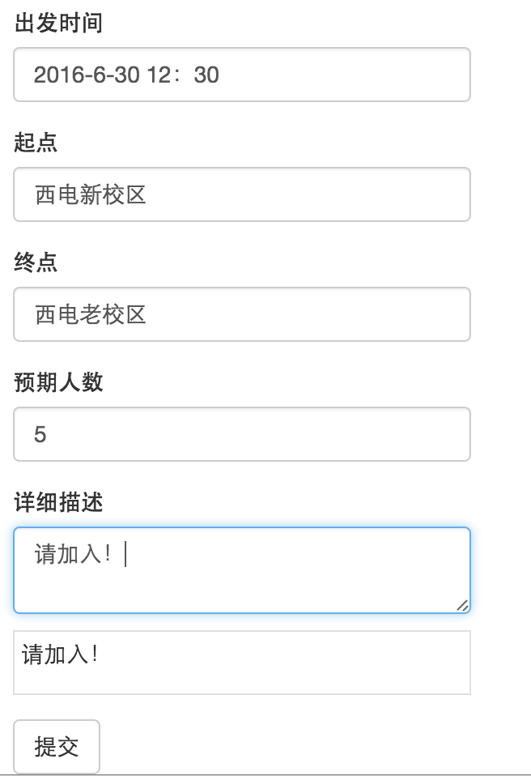

发布成功：

发布拼车消息：
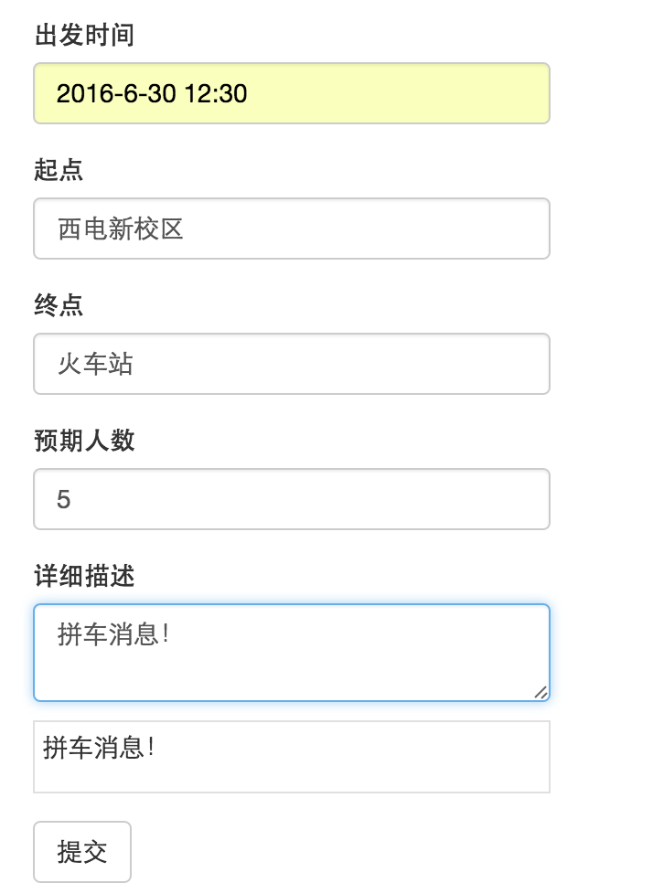

发布成功：
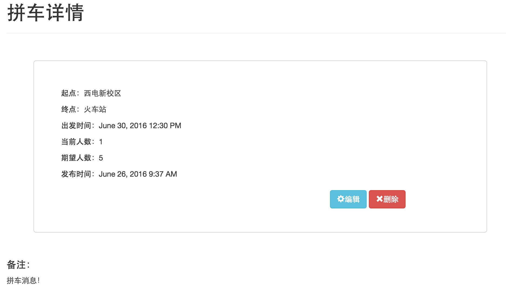

此次测试验证了所有信息是否均可正确添加，测试结果与预期结果相同。

#####2.4  TestCase-4所有的基本信息均可编辑测试
本次测试的主要内容是验证所有的基本信息是否均可编辑，测试的主要方法是编辑用户信息，从而观察系统的行为。在进行错误操作时，验证系统能否给出提示信息，测试系统的交互能力。
修改个人资料：
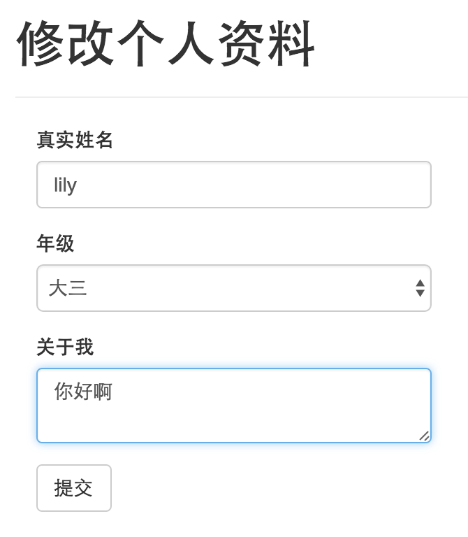

修改成功：
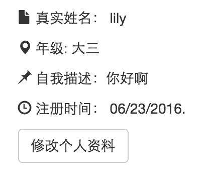

修改密码：
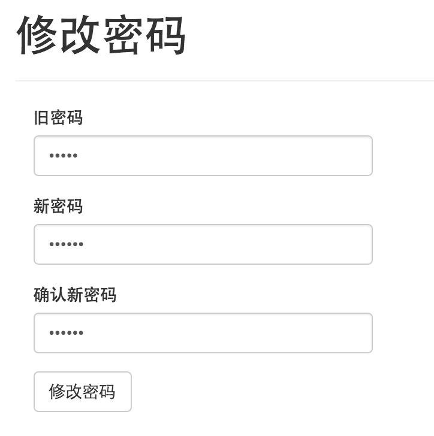

原密码输入错误：
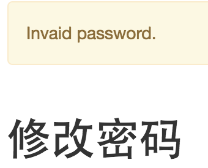

确认密码不一致：
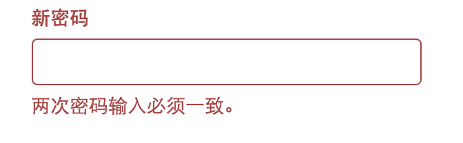

修改成功：
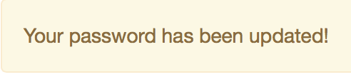

此次测试验证了所有基本信息的可编辑性，测试结果与预期结果一致。
#####2.5  TestCase-5所有的基本信息均可查询测试
本次测试的主要内容是验证所有基本信息的可查询性。测试的主要方法是，进入查询模块，对待查询信息进行查询，从而观察系统的行为，验证所有存在的查询项在单项查询和组合查询时是否可用。
查询拼车信息：
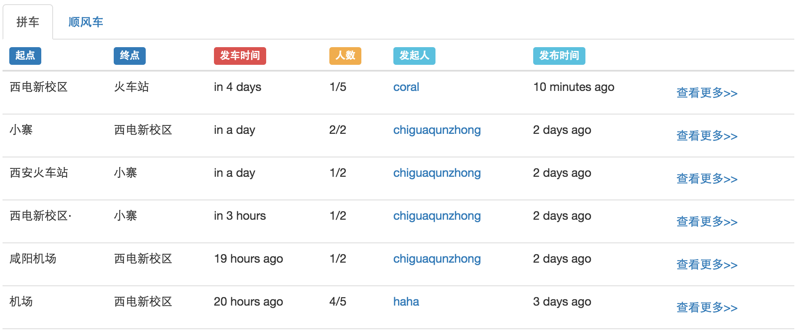

查询顺风车信息：
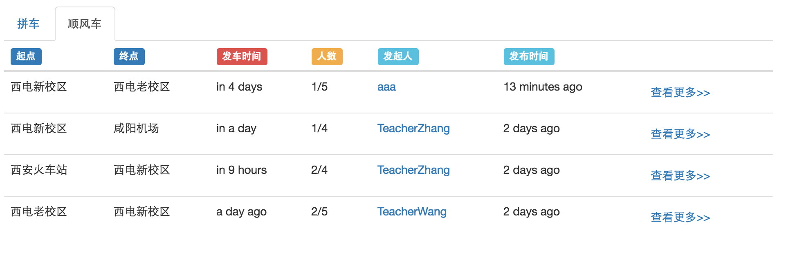

查询发起的拼车：
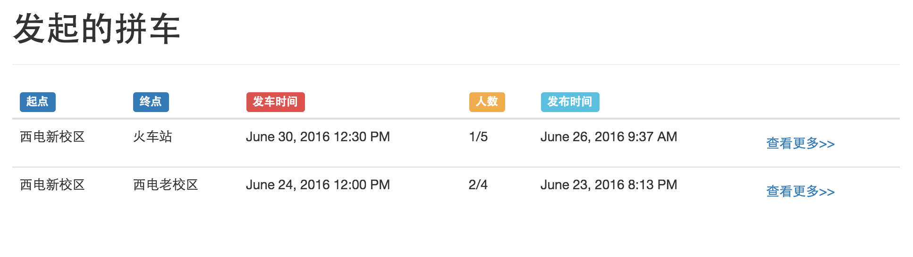

发起的顺风车：
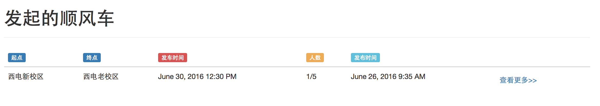

查询收到的申请：
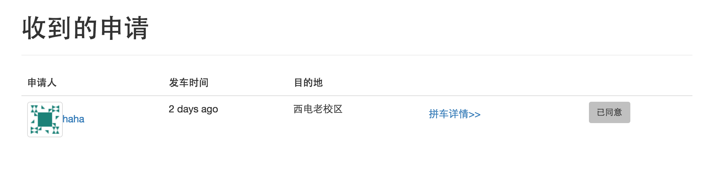

查询发出的申请：
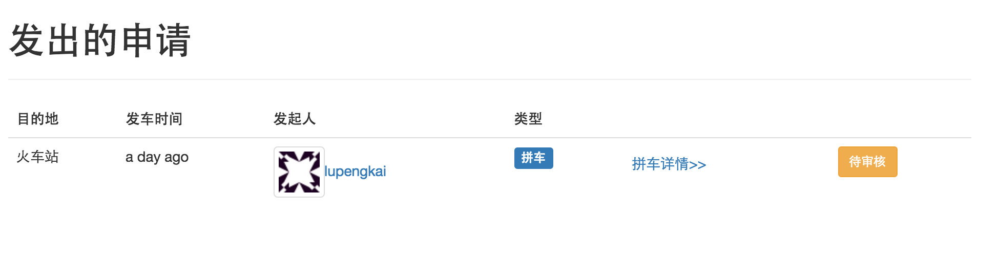

此次测试验证了所有基本信息的可查询性，测试结果与预期结果基本吻合。

#####2.6  TestCase-7所有基本信息均可删除测试
本次测试以信息发布模块为例，对信息进行删除操作。观察系统能否给出提示，从而验证系统的交互能力和友好性。
删除信息前：
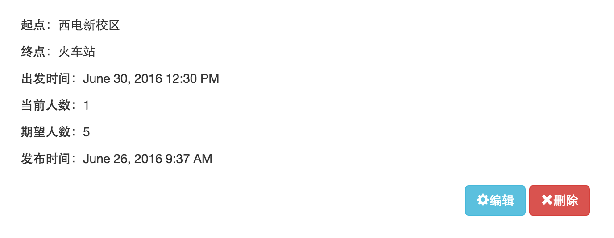

删除信息后：

此次测试主要验证了系统信息的可删除性，通过删除操作，从而观察系统能否给予提示。测试的结果是与预期相同。

####三、测试结果 
 本次软件测试过程中，基本功能测试结果与预期一致。性能测试结果良好。关于兼容性测试，系统在IE浏览器，Chrome浏览器，Safari浏览器，Firefox浏览器上均能够正常显示页面。